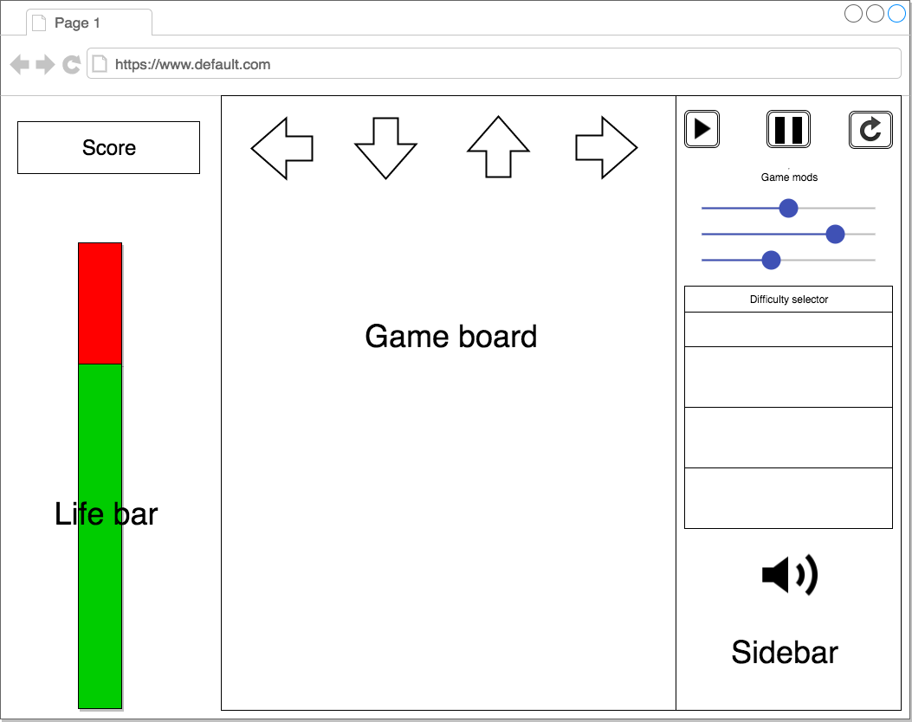

## Endless Revolution

### Background

Endless Revolution is an implementation of the popular 4-arrow rhythm game Dance Dance Revolution where players must press corresponding arrow keys as they scroll past a static outline of their respective shapes. The twist is that the gameplay doesn't end until the user misses too many consecutive arrows and causes life points to reach 0.

### Functionality & MVP

In the game, players will be able to:
- [ ] Press the arrow keys which correspond to the four gameplay controls (up, down, left, right)

Sidebar options:
- [ ] Choose a starting difficulty.
- [ ] Start, pause, and reset the game.
- [ ] Modify bomb frequency (arrows that when pressed penalize the player)
- [ ] Modify arrow speed / acceleration
- [ ] Mute music

This project will also include:
- [ ] An About modal describing the background and rules of the game
- [ ] Github / LinkedIn links

### Wireframes

This will be a single-page app with a gameplay screen and two sidebars.

The main gameplay screen will have the outline of arrows at the top with a board of incoming arrows that scrolls continuously upwards.

On the right is a sidebar that will have buttons at the top to start, pause, and reset the game depending on the current context. Below will be sliders to mod current gameplay such as bomb frequency and arrow speed. Furthest down will be a dropdown of starting difficulties to choose from and an audio mute button.

On the left is a score that increments upon successful presses and a life bar.

### Architecture and Technologies

This project will use the following technologies:
* Vanilla JavaScript and jQuery for game logic
* HTML5 Canvas and Easel for DOM manipulation and rendering
* `audio.js` for music playback

The following scripts will be specific to the game itself:
`game.js`: This will handle setting/resetting/pausing game state, rendering to the DOM, and making the appropriate calls to `sound.js`. It will also contain an instance of the board.
`board.js`: This will handle the random creation of arrows/bombs, and implement any mods. It will also keep an instance of the life status and score.
`arrow.js`: This will have an identity as either an arrow or bomb and a value assigned by the scoring logic.
`logic.js`: This will handle the scoring logic based on the timing of the arrows.

### Implementation Timeline

**Day 1**: Setup node modules, run webpack, and install `sound.js` and `easel.js`.  Create `webpack.config.js` and `package.json`.  Write a basic entry file and the skeleton of all 4 scripts outlined above. Get an audio file from `sound.js` running on the site.

**Day 2**: Learn `easel.js`. Create the arrow/bomb object to be constructed by the board and be able to render them. Render the structure of the entire screen (main board and sidebars).

**Day 3**: Create the scoring logic for the arrows. Implement scrolling function for the board, generation of arrows based on time elapsed, and mods. Set win/lose conditions for the lifebar.

**Day 4**: Create controls for the game. Implement and test different starting levels. Finish styling the game screen.

### Bonus features

Some extra features I can include are:
- [ ] Multiplayer and versus AI modes
- [ ] Input options for a dance pad
